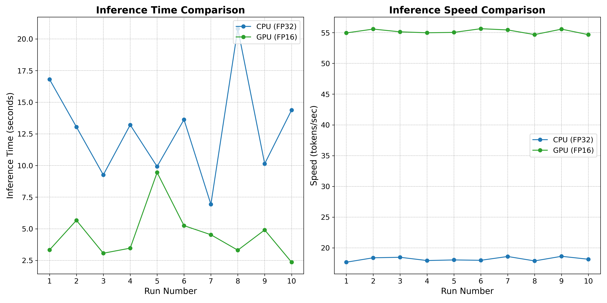

### **README for Qwen2.5-0.5B-Instruct Setup**

This guide explains how to set up the environment to run **Qwen2.5-0.5B-Instruct** on both **ENS (CPU)** and **ECS (GPU)**.

---

### **1. ENS (CPU) Setup**

- **Environment:**  
  - 8 vCPUs, 16 GB RAM  
  - Ubuntu 22.04  
  - PyTorch FP32 inference (`max_new_tokens=512`)  

#### **1.1 Install Required Packages**

```bash
# Update system packages
sudo apt update && sudo apt upgrade -y

# Install Python 3 and pip
sudo apt install -y python3 python3-pip

# Install PyTorch (CPU version)
pip3 install torch torchvision torchaudio --index-url https://download.pytorch.org/whl/cpu

# Install Transformers and ONNX runtime
pip3 install transformers --index-url https://pypi.org/simple
pip3 install onnxruntime --index-url https://pypi.org/simple
```

---

### **2. ECS (GPU) Setup**

- **Environment:**  
  - Instance: **ecs.gn7i-c16g1.4xlarge** (Alibaba Cloud)  
  - 16 vCPUs, 60 GB RAM, NVIDIA A10 GPU  
  - Ubuntu 22.04  
  - PyTorch FP16 inference (`max_new_tokens=512`)  

#### **2.1 Install NVIDIA Drivers**

```bash
# Update system packages
sudo apt update && sudo apt upgrade -y

# Install NVIDIA driver utilities (version 535 recommended for A10 GPUs)
sudo apt install nvidia-driver-535 nvidia-utils-535
```

Reboot the system to apply changes:
```bash
sudo reboot
```

Verify GPU setup with:
```bash
nvidia-smi
```

---

#### **2.2 Install Required Python Libraries**

```bash
# Install PyTorch with GPU (CUDA) support
pip3 install torch torchvision torchaudio --index-url https://download.pytorch.org/whl/cu118

# Install Transformers and BitsAndBytes
pip3 install transformers --index-url https://pypi.org/simple
pip3 install onnxruntime --index-url https://pypi.org/simple
```

---

### **3. Verify Setup**

Run the following Python script to verify CPU or GPU setup:

```python
import torch

print(f"CUDA available: {torch.cuda.is_available()}")
if torch.cuda.is_available():
    print(f"Device name: {torch.cuda.get_device_name(0)}")
```

Expected output on ECS:
```
CUDA available: True
Device name: NVIDIA A10
```

---

### **4. Current Edge Node GPU Setup**

Our **edge nodes** typically have the following GPUs available:
- **NVIDIA RTX 3060**
- **NVIDIA RTX 3070**
- **NVIDIA RTX 4070**

During testing on **Singapore ENS**, I was potentially not whitelisted to access GPUs, preventing me from using GPU-based inference. If GPU access becomes available, I expect performance similar to what was achieved on the ECS with the NVIDIA A10 GPU.

---

### **5. FP32 vs FP16 and Impact on Inference**

FP32 (32-bit floating point) provides high numerical precision and is the default for CPUs. This is because CPUs have native hardware support for FP32, ensuring stable performance without precision errors. However, FP32 requires more memory and computational resources, resulting in slower inference compared to FP16.

FP16 (16-bit floating point) is optimized for GPUs with Tensor Cores, allowing for faster matrix operations, reduced memory usage, and higher throughput. However, most CPUs do not natively support FP16 operations. Instead, FP16 operations on CPUs are emulated in software, which can lead to inefficiencies such as slower performance and potential errors from overflow or underflow due to FP16's smaller range.

There are exceptions: some modern CPUs (e.g., those with AVX-512 VNNI on Intel or Neon/SVE on ARM) support low-precision formats. However, these CPUs often use bfloat16 (BF16) rather than FP16. BF16 retains the same exponent range as FP32, reducing errors while still improving performance. Despite this, FP32 remains the preferred format for most CPU inference tasks, while FP16 is optimal for GPUs.

---

### **6. Performance Comparison**

Below is a comparison of inference performance between **CPU** (FP32) and **GPU** (FP16) across multiple runs:



In the graph above, the GPU consistently outperforms the CPU in both inference time and speed, demonstrating the significant benefits of using FP16 with GPUs.  

---

### **7. Performance Improvements**

Inference performance can be significantly enhanced by applying these strategies:

- **Model Quantization:** Lowering model precision to 8-bit (e.g., with `BitsAndBytes`) reduces memory usage and boosts inference speed with minimal accuracy loss.
- **Reduce `max_new_tokens`:** This parameter directly affects inference time. Lowering it can drastically improve response time, especially for shorter tasks.
- **Batch Inference:** Running multiple queries in one batch maximizes GPU utilization, reducing latency and improving throughput.
- **ONNX Runtime:** Optimizes CPU inference using libraries like **MKL-DNN**, speeding up model execution.
- **vLLM:** A specialized inference engine that optimizes token streaming and memory allocation, providing significant speed-ups for models with large context sizes or frequent queries.

These strategies improve both CPU and GPU performance, depending on the infrastructure. I highly recommend testing them to identify the most impactful optimizations for your setup.

---